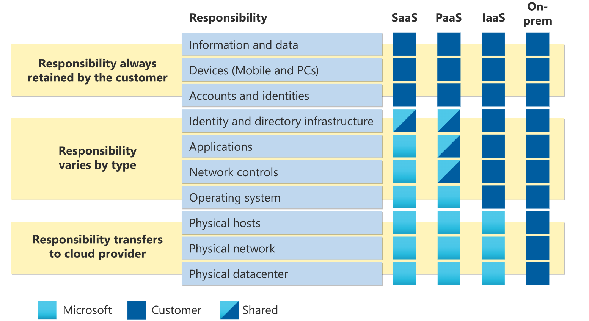
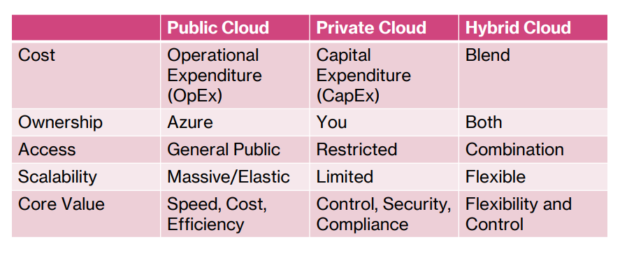

# Azure

- azure services - building blocks to build your own solutions
- azure marketplace - pre-built solutions

## Shared responsibility model

- cloud provider - responsible for the security of the cloud
- customer - responsible for the security in the cloud

## IaaS, PaaS, SaaS

- IaaS - infrastructure as a service - you manage the applications, data, runtime, middleware, and OS. The cloud provider manages the virtualization, servers, storage, and networking.
  -Iaas Example: Azure Virtual Machines, Azure Storage, Azure Virtual Network
- PaaS - platform as a service - you manage the applications and data. The cloud provider manages the runtime, middleware, OS, virtualization, servers, storage, and networking.
- PaaS Example: Azure App Service, Azure SQL Database, Azure Functions
- SaaS - software as a service - the cloud provider manages everything. You just use the software.
- SaaS Example: Microsoft 365, Dynamics 365, Azure DevOps

## Cloud models

- public cloud - services offered over the public internet and available to anyone who wants to purchase them. Examples: Azure, AWS, Google Cloud
- private cloud - services offered over a private network and available only to a specific organization. Examples: Azure government, Azure Stack (Azure local)
- hybrid cloud - a combination of public and private cloud services. Examples: Azure Arc, Azure Stack

## Benefits of Cloud Computing

1. High availability - cloud providers have multiple data centers around the world, so if one data center goes down, your applications can still run from another data center.
