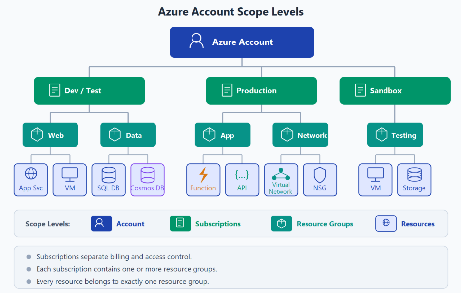
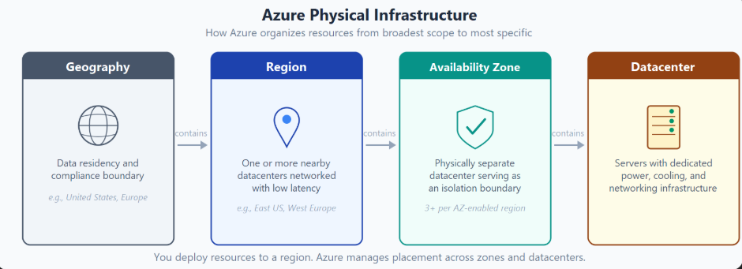
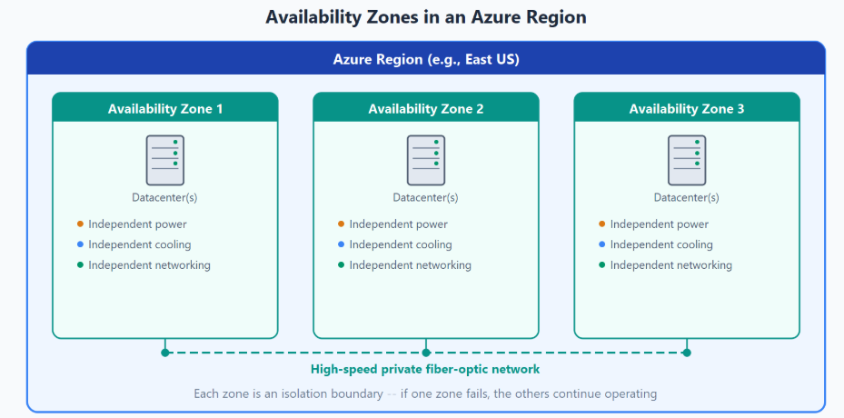
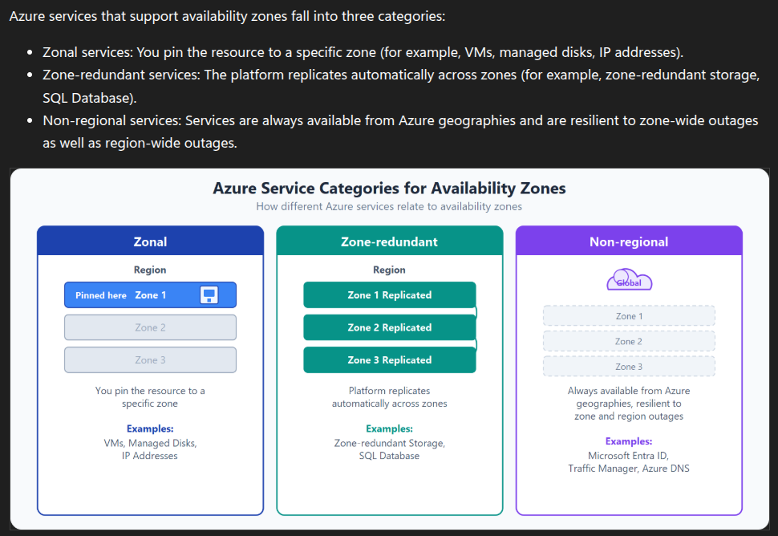
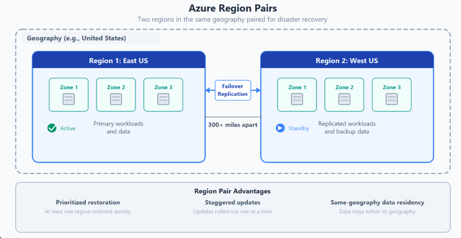
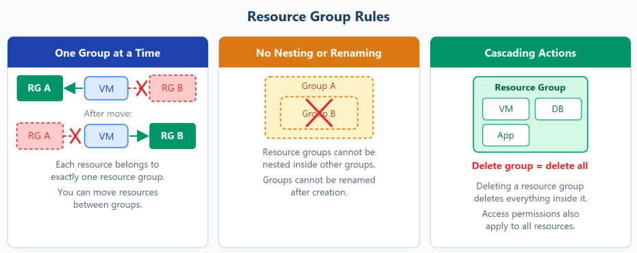
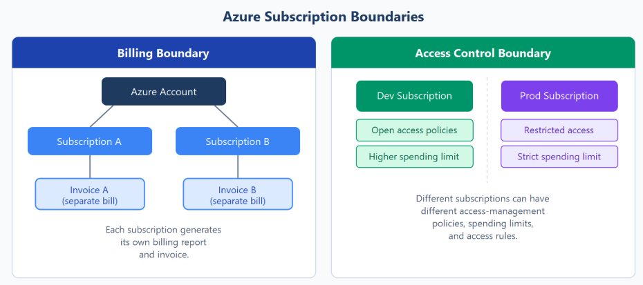
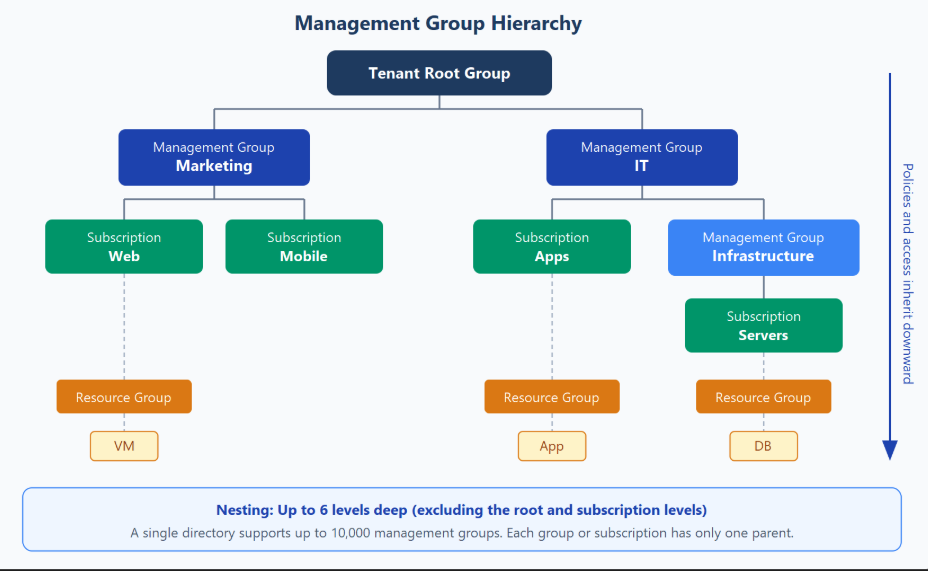

# Introduction to Cloud Infrastructure

## Azure account scope levels

---

## Azure physical infrastructure

### Availability Zones in Azure

### Services categorized by availability zones

### Region pairs in Azure

- Most Azure regions are paired with another region within the same geography (such as US, Europe, or Asia) at least 300 miles away
- This approach allows for the replication of resources across a geography that helps reduce the likelihood of interruptions because of events such as natural disasters, civil unrest, power outages, or physical network outages that affect an entire region.
- Not all Azure services automatically replicate data or automatically fall back from a failed region to cross-replicate to another enabled region. In these scenarios, recovery and replication must be configured by the customer.

### Sovereign regions in Azure

- Azure has soverign regions that are physically isolated from other Azure regions and are designed to meet specific regulatory and compliance requirements for government agencies and organizations with strict data residency needs.

---

## Azure Management Infrastructure

### Azure resource group rules

- Azure ask for a region when we create a resource group. But we can put resources in that resource group in any region.
- It ask because it needs to store metadata about the resource group, such as its name, location, and tags. This metadata is used to manage the resource group and its resources, but it doesn't affect where the resources themselves are located.
- But when the resource group region goes down, you can't manage the resources in that resource group. You can still access the resources, but you can't make changes to them until the resource group region is back up.

### Azure subscriptions

In Azure, subscriptions are a unit of management, billing, and scale. Subscriptions let you organize resource groups and control billing separately from access.

### Azure management groups

- Resources go into resource groups, and resource groups go into subscriptions. For a small environment, that's enough. But when you have many subscriptions across multiple teams or geographies, you need a way to manage access and policies at a higher level.
- Azure management groups sit above subscriptions. You organize subscriptions into management groups and apply governance conditions — like access policies or compliance rules — to the group.

- Apply a policy across subscriptions. You could limit VM locations to the US West Region in a group called Production. This policy inherits to all subscriptions under that management group and applies to all VMs in those subscriptions. The resource or subscription owner can't override it, which strengthens governance.
- Grant access to multiple subscriptions at once. By placing subscriptions under a management group, you can create one Azure RBAC assignment on the group. All sub-management groups, subscriptions, resource groups, and resources underneath inherit those permissions — no need to script Azure RBAC across individual subscriptions.
