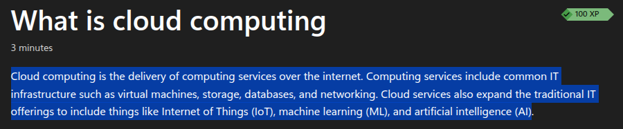
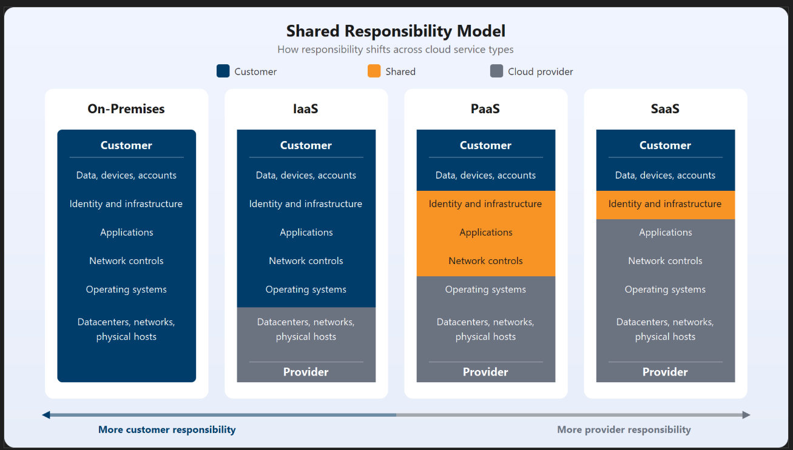
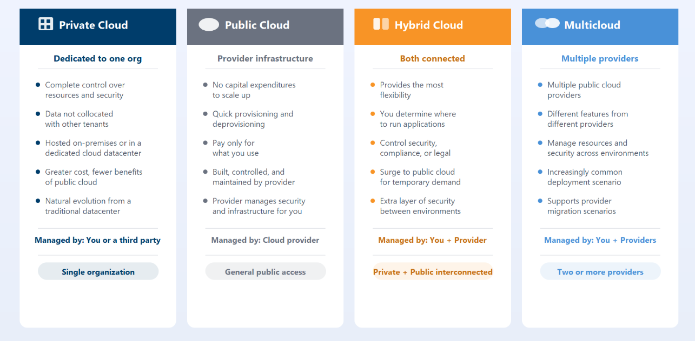
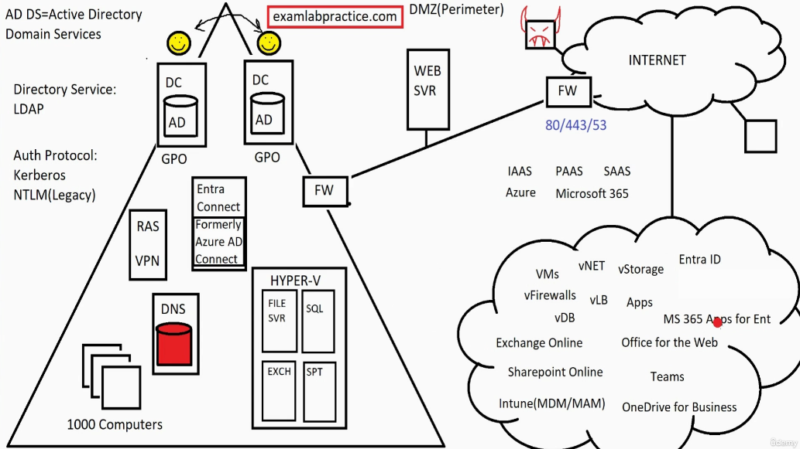

# Describe cloud concepts

## Shared responsibility model

## Cloud deployment models

### Azure Arc

Azure Arc lets you manage servers and databases that are outside of Azure (like in your own office or on AWS/Google Cloud) using the Azure Portal. It’s like a "remote control" that lets you apply Azure security rules and updates to any computer, anywhere, without moving them.

## Azure Vmware Solution

This service lets you move your existing VMware setup from your local data center directly into Azure's hardware. It is a "lift and shift" solution, meaning you can stop maintaining physical servers but keep using the exact same VMware tools and workflows your team already knows.

- **vmware means**: VMware is software that lets one physical server act like many separate computers. It installs a "manager" layer on the hardware that carves up the CPU and RAM into Virtual Machines (VMs). This allows you to run different operating systems (like Linux and Windows) on the same box at the same time.

## CapEx vs OpEx

- CapEx refers to up-front spending on physical infrastructure like servers, network hardware, and datacenter space.
- OpEx refers to ongoing spending on services over time.

## Benefits of cloud computing

- **Availability**: High availability focuses on ensuring maximum availability, regardless of disruptions or events that may occur.
- **Scalability**: Scalability refers to the ability to adjust resources to meet demand.
- **Reliability**: Reliability is the ability of a system to recover from failures and continue to function.
- **Predictability**: Predictability is the ability to forecast costs and performance based on usage patterns.
  - **Performance Predictability** : Performance predictability focuses on predicting the resources needed to deliver a positive experience for your customers. Autoscaling, load balancing, and high availability are just some of the cloud concepts that support performance predictability.
    - **Cost Predictability** : Cost predictability focuses on forecasting costs based on usage patterns. Azure Cost Management and Azure Advisor are just some of the cloud concepts that support cost predictability.
- **security and governance** : Security and governance are the ability to protect data and resources while maintaining compliance with regulations.

## sustainability considerations

- right-size
- automate
- monitor
- continuously optimize.

## Azure , Microsoft 365 and On-premises

- Active Directory Domain Services (AD DS) is a directory service that provides authentication and authorization for users and computers in a Windows domain. It is typically used in on-premises environments.
- Azure Active Directory (Azure AD)(Entra ID) is a cloud-based identity and access management service that provides authentication and authorization for users and applications in the cloud.
- Microsoft 365 is a suite of cloud-based productivity services that includes applications like Word, Excel, PowerPoint, and Outlook, as well as cloud services like OneDrive, SharePoint, and Teams.
- 🛑 Microsoft 365 also integrates with Azure AD (Entra ID) for identity and access management, providing a unified experience for users across both on-premises and cloud environments.
- Azure AD Connect (Entra ID Connect) is a tool that allows you to synchronize your on-premises Active Directory with Azure AD (Entra ID), enabling users to use the same credentials for both environments.
