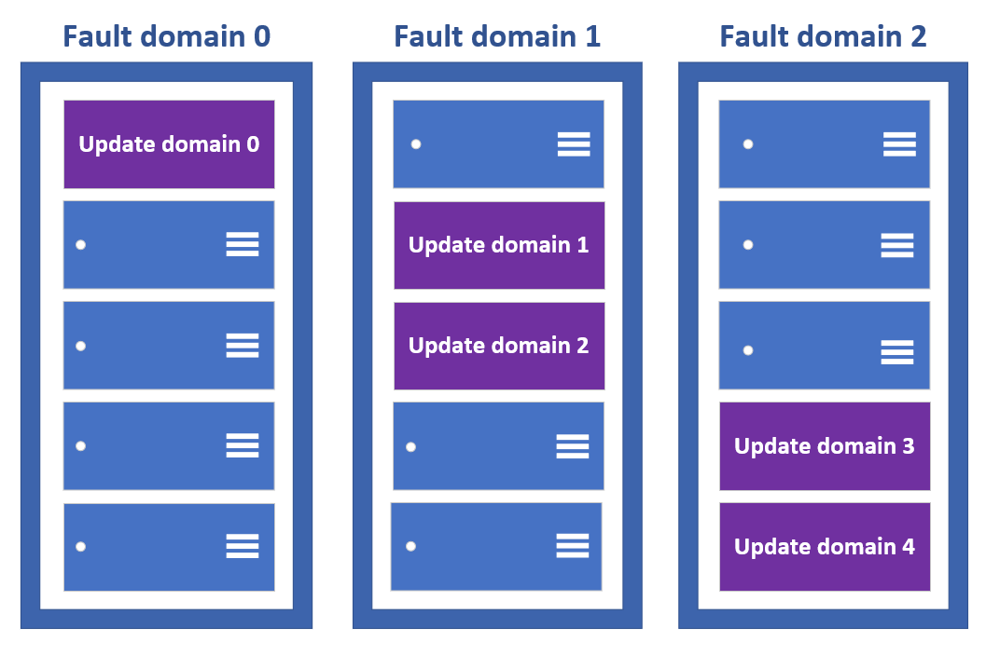

# Virtual Machines

- IAAS service that provides on-demand, scalable computing resources.

## Virtual machine scale sets

- Virtual machine scale sets let you create and manage a group of identical, load-balanced VMs.
- The number of VM instances can automatically increase or decrease in response to demand, or you can set it to scale based on a defined schedule.
- Virtual machine scale sets also automatically deploy a load balancer to make sure that your resources are being used efficiently.

## Virtual machine availability sets

- Availability Set is a logical grouping capability you use to ensure that the VMs you deploy are redundant and available during either planned maintenance or unplanned hardware failures.

### Fault Domains (FD)

- A Fault Domain is essentially a physical rack in the Azure datacenter.
- **The Risk** : Each rack has its own power source and network switch. If the switch fails or the power goes out for that rack, everything in it goes down.
- **The Solution** : Azure spreads your VMs across different Fault Domains (usually up to 3). If Rack 1 loses power, your VM in Rack 2 stays online.

### Update Domains (UD)

- An Update Domain is a logical group of hardware that can be patched or rebooted at the same time by Microsoft.
- **The Risk** : When Microsoft needs to perform "Planned Maintenance" (like patching the host OS), they have to reboot the physical servers.
- **The Solution** : Azure divides your Availability Set into Update Domains (up to 20). Microsoft guarantees they will only reboot one UD at a time. While UD1 is rebooting, your VMs in UD2, UD3, etc., are still running.

