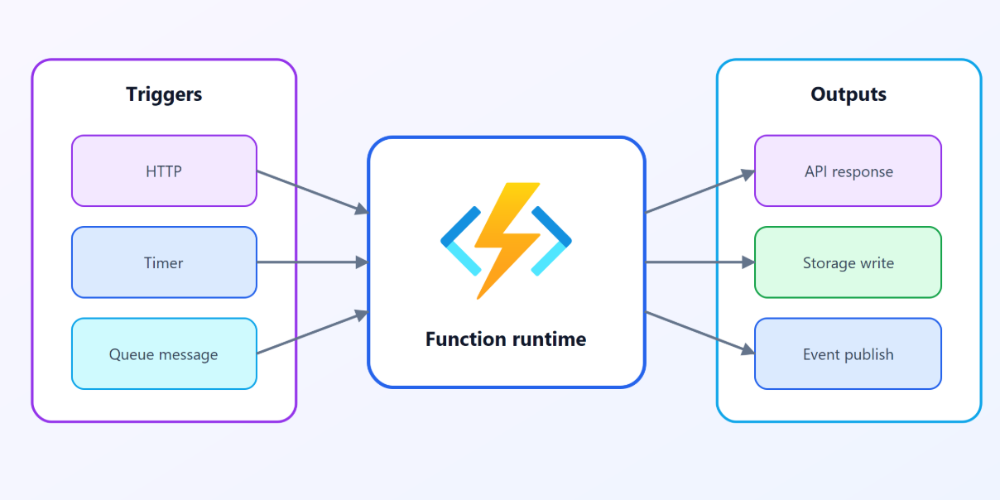

# Azure Functions

- Azure Functions is an event-driven, serverless compute option
- doesn’t require maintaining virtual machines or containers.
- Functions scale automatically based on demand, so they may be a good choice when demand is variable.
- In this model, Azure charges you only for the CPU time used while your function runs.
- Functions can be either stateless or stateful.

