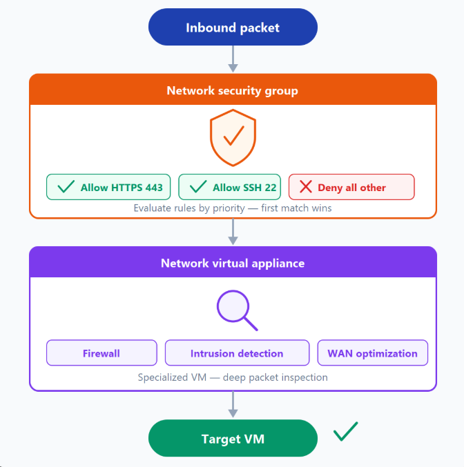
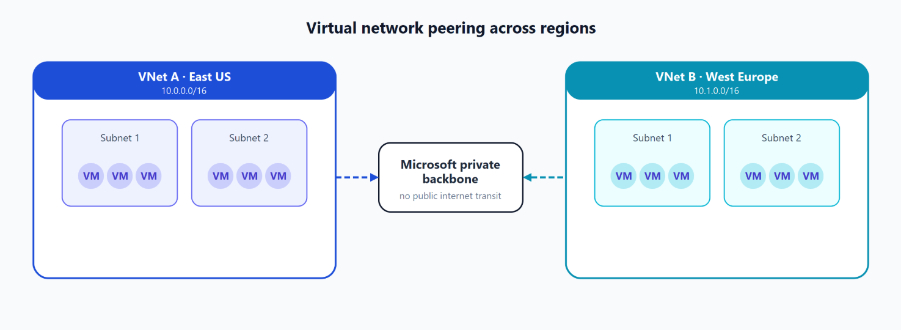

# VNet

- virtual private network
- regionally isolated network
- can span multiple availability zones
- By default internet access is allowed, but can be restricted with NSGs and UDRs
- can be peered with other VNets

---

## Filter traffic

### NSG (Network Security Group)

- filter traffic at the subnet or NIC level
- You can define these rules to allow or block traffic, based on factors such as source and destination IP address, port, and protocol.

### Network virtual appliances

- specialized VMs that can be compared to a hardened network appliance.
  -A network virtual appliance carries out a particular network function, such as running a firewall or performing wide area network (WAN) optimization.

## 

---

## VNet peering

- connect two VNets together
- traffic between peered VNets is private and stays on the Microsoft backbone network
- can be peered across regions (global VNet peering)

---

## Connect on premises network to Azure VNet

### point-to-site VPN

- connect individual devices to Azure VNet

### site-to-site VPN

- connect on premises network to Azure VNet

### ExpressRoute

- private connection between on premises network and Azure VNet
- dedicated connection
- similar to aws direct connect
