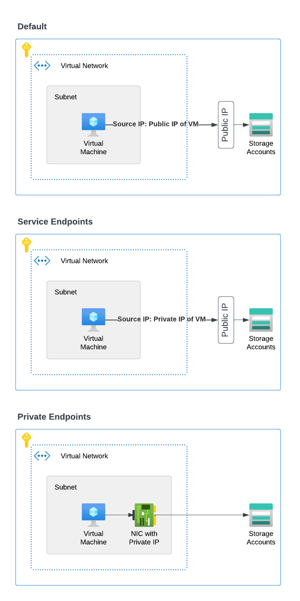

# Service Endpoints vs Private Endpoints in Azure

## Service Endpoints

- A Service Endpoint connects your Virtual Network (VNet) directly to an Azure service (like Storage, SQL) over the Azure backbone network.
- Traffic goes through Azure’s internal network, not the public internet
- Service still have a public IP address, but access is restricted to the VNet
- Simpler to set up and manage

## Private Endpoints

- A Private Endpoint gives the Azure service a private IP inside your VNet.
- Traffic to the service goes through the private IP, completely isolating it from the public internet
- The service (e.g., Storage, SQL) is mapped into your VNet
- It gets a private IP address

