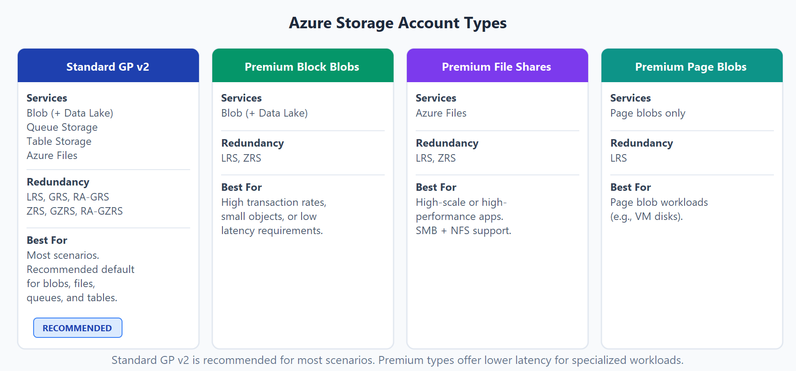
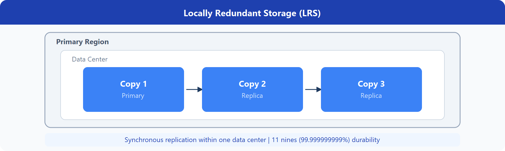
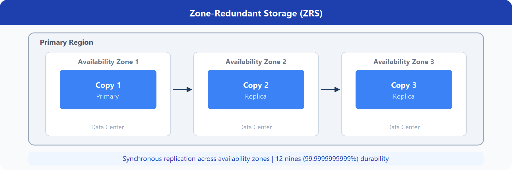
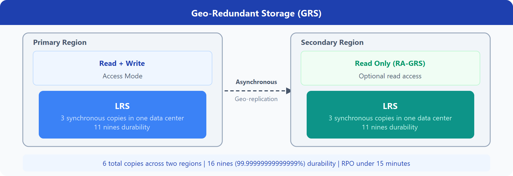
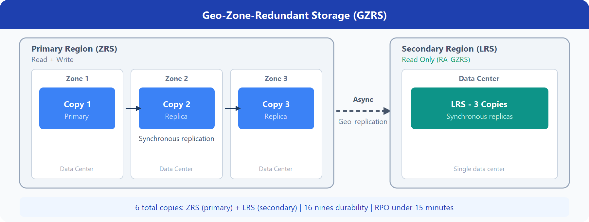

# Azure Storage Account

- Think of it as a container (or namespace) that holds all your storage services under one roof.
- Instead of managing files, databases, and messages separately, Azure groups them inside a storage account.
- The type of account determines the storage services and redundancy options

## Redundancy Options

### Redundancy in Primary Region

1. Locally Redundant Storage (LRS)
   - Data is replicated three times within a single data center in the primary region.
   - This protects against hardware failures but not against data center outages.
   - 3 copies = usually across different racks / hardware
   - But still inside same physical building (data center)

    

2. Zone-Redundant Storage (ZRS)
   - replicates your Azure Storage data synchronously across three Azure availability zones in the primary region
   - With ZRS, data stays available for read and write operations even if one zone is unavailable

   

### Redundancy in Secondary Region

- Azure assigns the paired secondary region based on region pairs.
- By default, secondary-region data isn't readable unless failover occurs. If the primary region is unavailable, you can fail over so the secondary region becomes primary.

1. Geo-redundant storage (GRS)
   - GRS uses LRS in both regions
   - GRS copies data synchronously three times in the primary region (LRS), then asynchronously to the secondary region (also LRS)

    

2. Geo-zone-redundant storage (GZRS)
   - while GZRS uses ZRS in the primary region and LRS in the secondary region.
   - Data is copied across three availability zones in the primary region and replicated to the paired secondary region using LRS

    
