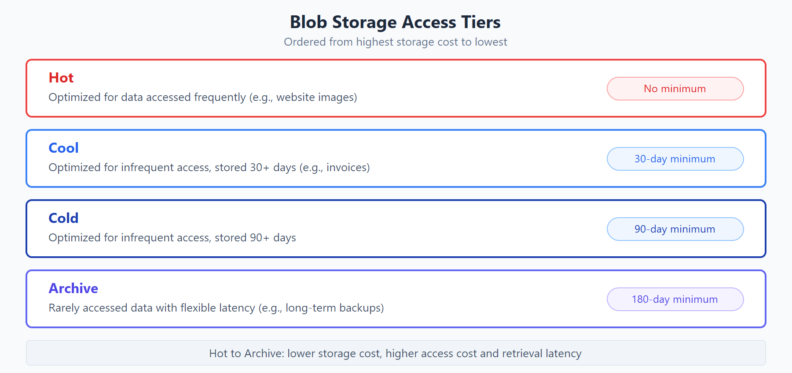

# Azure Blobs

- similar to aws s3
- object storage
- can be used for storing files, images, videos, etc.
- can access via http/https
- Users or client applications can access blobs via URLs, the Azure Storage REST API, Azure PowerShell, Azure CLI, or an Azure Storage client library.

## Ideal for

- Serving images or documents directly to a browser.
- Storing files for distributed access.
- Streaming video and audio.
- Storing data for backup and restore, disaster recovery, and archiving.
- Storing data for analysis by an on-premises or Azure-hosted service.

---

## Blob Storage Tiers

access tiers that balance storage cost against retrieval speed.

- Hot access tier: Optimized for storing data that is accessed frequently (for example, images for your website).
- Cool access tier: Optimized for data that is infrequently accessed and stored for at least 30 days (for example, invoices for your customers).
- Cold access tier: Optimized for storing data that is infrequently accessed and stored for at least 90 days.
- Archive access tier: Appropriate for data that is rarely accessed and stored for at least 180 days, with flexible latency requirements (for example, long-term backups).

