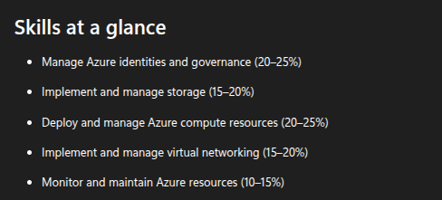

AZ-104 Exam link (resources)
https://learn.microsoft.com/en-us/credentials/certifications/azure-administrator/?practice-assessment-type=certification

AZ-104 Exam Guide
https://learn.microsoft.com/en-us/credentials/certifications/resources/study-guides/az-104

- Expires after 12 months. Can renew by passing a free online assessment on Microsoft Learn.
- Must score at least 700 out of 1000 to pass the exam.

# Exam areas

refer this link for more details: https://learn.microsoft.com/en-us/credentials/certifications/resources/study-guides/az-104
